

  
### 모임관리와 일정을 한 번에: 컴온! (2.0)

  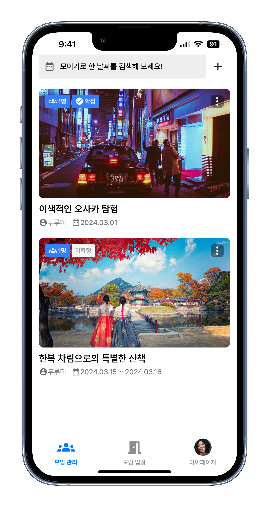

### 🧑🏻‍💻 Features

모임 생성부터 관리까지 간편하게, 입장 코드로 참여자를 제한하세요. 날짜 결정은 투표로 신속히, 장소 결정까지 한 번에 해결하세요.

* 👆 원터치 로그인 - 간편한 한 번의 터치로 로그인하세요!
* 🚀 모임 즉시 시작 - 언제 어디서나 쉽게 모임을 만들고 시작하세요.
* 🗳️ 날짜 투표 - 투표로 모임 날짜를 빠르게 정하세요.
* 🔍 모임 날짜 검색 - 날짜 범위로 필터링하여 원하는 모임을 빠르게 찾아보세요!
* 🔄 연속 모임 계획 - 모임 카드로 다음 모임도 즉시 계획하세요.
* 🔒 비공개 모임 - 입장 코드로 비공개 모임에 안전하게 참여하세요.

 

  
  

 
 
 
 
 
 
 
 
 
 
 
 
 
 
 
 

## 📋 Table of Contents

- [🧑🏻‍💻 기능 소개](#-Features)
- [📱 데모](#-Demo)
- [🛠️ 기술 스택](#️-기술-스택)
- [🛠️ 프로젝트](#️-프로젝트)
  - [모듈 구조](#모듈-구조)
  - [디자인 시스템](#디자인-시스템)
  - [Unit Testing](#Unit-Testing)
  - [컴포넌트 동작 검증을 위한 RNTL 활용](#컴포넌트-동작-검증을-위한-rntl-활용)
- [🏓 협업](#-협업)
  - [백엔드팀과의 API 문서 기반 협업](#백엔드팀과의-api-문서-기반-협업)
  - [PR 코드 리뷰](#pr-코드-리뷰)
  - [피그마를 통한 디자이너와의 원활한 커뮤니케이션](#피그마를-통한-디자이너와의-원활한-커뮤니케이션)
  - [협업 도구](#협업-도구)
- [🚀 Deploy](#-deploy)
  - [Analytics](#analytics)
  - [Performance](#performance)
- [📝 Article](#-article)

 

## 📱 Demo
<table>
  
<tr>
<td>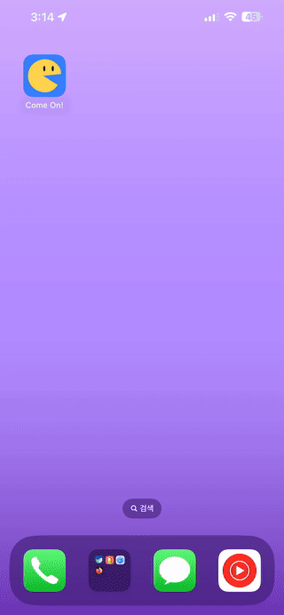</td>
<td valign="top">

### 쉽고 빠르게

  - 사용자의 편의성을 위해 **애플 로그인**과 **구글 로그인**을 포함한 소셜 로그인 기능을 지원합니다.
  이를 통해 사용자는 복잡한 회원가입 절차 없이도 빠르고 간편하게 로그인할 수 있습니다.

  - 로그인 과정에서 사용자 경험을 최우선으로 고려합니다. 로그인이 진행되는 동안, 사용자는 로그인 상태(진행 중, 에러 발생)에 따른 명확한 시각적 피드백을 받게 됩니다. 이는 사용자가 현재 로그인 과정에서 어떤 단계에 있는지, 혹은 로그인 시도가 실패했는지를 쉽게 이해할 수 있도록 돕습니다.

</td>
</tr>

<tr>
<td></td>
<td valign="top">

### 모임 즉시 시작

  - 사용자의 디바이스에서 직접 원하는 이미지를 업로드할 수 있는 기능을 지원합니다. 이를 통해 사용자는 자유롭게 컨텐츠를 커스터마이즈할 수 있습니다.

  - 모임 투표 기능을 통해 사용자는 투표 범위를 손쉽게 설정할 수 있으며, 선택한 날짜에 대한 시각적 피드백을 받을 수 있습니다. 이 기능은 사용자가 투표 범위를 더욱 편리하게 선택할 수 있도록 설계되었습니다.

  - 이러한 기능들은 사용자의 경험을 강화하고, 애플리케이션의 사용성을 높이는 데 중점을 두었습니다.

</td>
</tr>

<tr>
<td>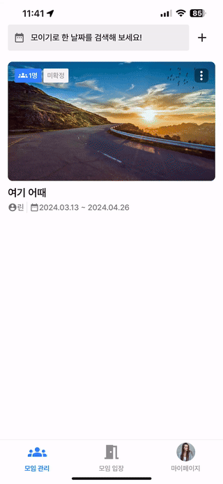</td>
<td valign="top">

### 모임 공유 코드

  - 모임을 생성한 사용자가 초대 코드를 발급받아, 이를 다른 사용자들과 손쉽게 공유할 수 있게 해줍니다. 해당 초대 코드를 활용함으로써, 참여자들은 복잡한 절차 없이 단순히 코드를 입력하는 것만으로도 모임에 즉시 참여할 수 있는 편리함을 제공합니다.

  - 초대 코드가 만료된 경우, 사용자는 원터치로 간편하게 초대 코드를 갱신하여 새로운 코드를 생성할 수 있습니다.

</td>
</tr>

<tr>
<td>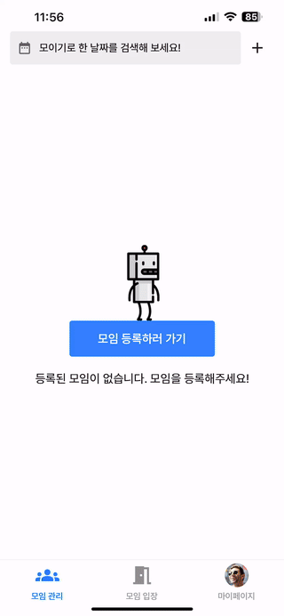</td>
<td valign="top">

### 우리 지금 만나

  - 사용자가 공유받은 초대 코드를 입력하면, 자동으로 모임에 참가하게 됩니다. 입력 시 대소문자 구분 없이 모든 문자는 자동으로 대문자로 처리되어, 사용 편의성을 높입니다. 
  
  - 잘못된 코드를 입력했거나 올바른 코드가 확인되면, 사용자에게는 즉각적인 시각적 피드백이 제공됩니다, 이를 통해 사용자는 자신의 입력 상태를 명확하게 인지할 수 있습니다.

</td>
</tr>

<tr>
<td>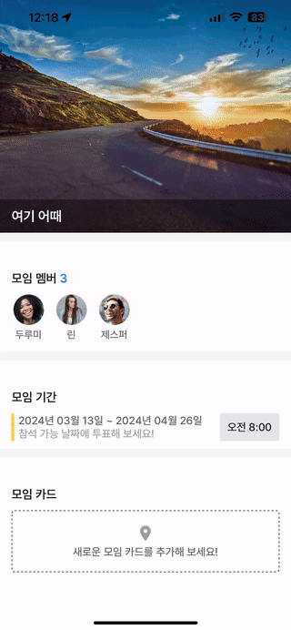</td>
<td valign="top">

### 이때 만날까?

  - 사용자는 설정된 가능한 날짜 범위 내에서 원하는 날짜에 투표할 수 있습니다. 투표 과정은 사용자 인터페이스(UI)를 통해 직관적으로 이루어지며, 어떤 참가자가 특정 날짜에 투표했는지 쉽게 확인할 수 있습니다.

  - 전체 참가자 중 몇 명이 투표에 참여했는지도 간편하게 알 수 있어, 모임 일정 결정 과정을 효율적으로 지원합니다.

</td>
</tr>

<tr>
<td>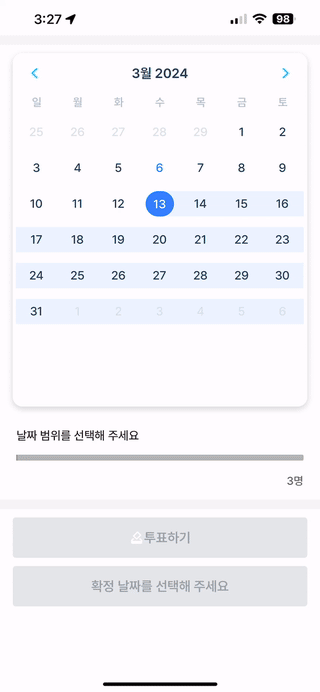</td>
<td valign="top">

### 모임 확정

  - 모임 투표가 완료되면, 선택된 날짜에 확정 표시를 함으로써 모든 사용자가 모임의 확정 날짜를 쉽게 확인할 수 있도록 합니다. 이는 사용자 간의 편리한 소통을 돕고, 모임 준비 과정에서의 혼란을 방지합니다.

  - 방장은 모임 예정 시간을 선택함으로써, 모임이 언제 열릴지를 결정할 수 있습니다.

</td>
</tr>

<tr>
<td>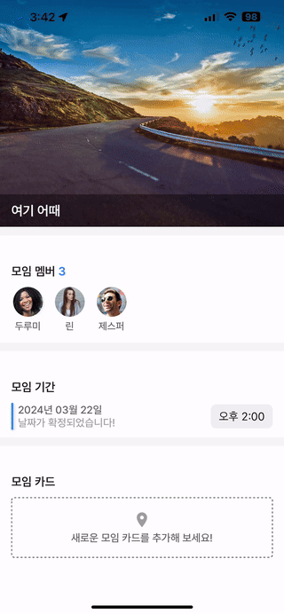</td>
<td valign="top">

### 1차 모임은 여기!

  - 모임 장소에 관한 정보는 관련된 카드를 작성함으로써, 참가자들이 모임 장소에 대한 세부 정보를 손쉽게 파악할 수 있습니다.

  - 사용자가 텍스트를 입력하는 동안, 화면은 사용자가 보기에 가장 편안한 최적의 위치로 자동으로 스크롤됩니다.

  - 소프트 키보드 다음 버튼 액션을 누를 때마다, 다음 입력 필드로 자동으로 포커스가 이동합니다.

  - 작성자는 카드가 발행되기 전, 미리보기 기능을 통해 카드가 어떤 모습으로 나타날지 손쉽게 확인할 수 있습니다.

</td>
</tr>

<tr>
<td>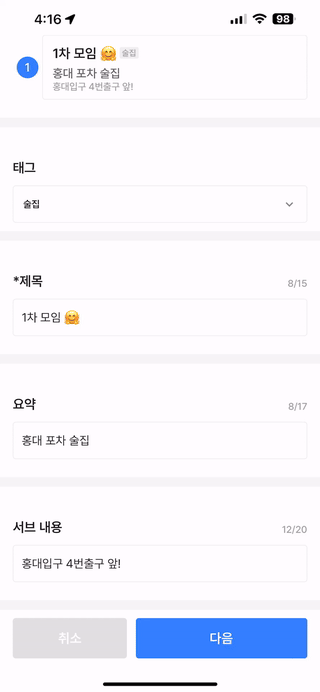</td>
<td valign="top">

### 장소가 어디야?

  - 참가자는 모임에 관련된 다양한 정보를 입력함으로써, 모임의 상세 정보를 구체적으로 기록할 수 있습니다.

</td>
</tr>

<tr>
<td>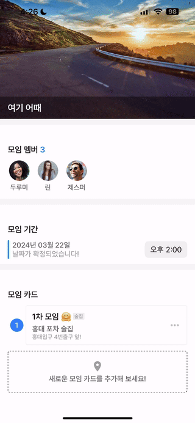</td>
<td valign="top">

### 네이티브 앱 활성화와 기능 통합

  - 모임 카드에 등록된 전화번호나 URL을 활용함으로써, 사용자는 네이티브 링크를 통해 다른 앱을 쉽게 활성화시킬 수 있습니다. 이를 통해 네이티브 기능의 통합을 통한 편리성이 제공됩니다

</td>
</tr>

<tr>
<td></td>
<td valign="top">

### 원하는 날짜의 모임 쉽게 찾기

  - 모임 날짜 필터 기능을 통해, 사용자는 특정 날짜에 예정된 모임만을 선택적으로 조회할 수 있습니다. 이를 통해 원하는 날짜 범위 내의 모임을 손쉽고 직관적으로 찾아볼 수 있습니다.

</td>
</tr>

<tr>
<td></td>
<td valign="top">

### 마이페이지

  - 마이페이지에서는 사용자가 자신의 이미지와 닉네임을 수정할 수 있습니다. 이미지 업데이트 시, 사용자에게 이미지가 업데이트 중임을 알리는 표시가 나타납니다.

  - 닉네임 수정 시, 사용자에게 기존 닉네임을 시각적으로 표시하며, 필요할 경우 원래 닉네임으로 쉽게 되돌릴 수 있는 옵션을 제공함으로써 사용자 경험을 향상시켰습니다.

  - 정보가 업데이트 될 때, 사용자와 관련된 모든 모임 정보도 즉시 최신 상태로 갱신됩니다.

</td>
</tr>

</table>

## 🛠️ 기술 스택

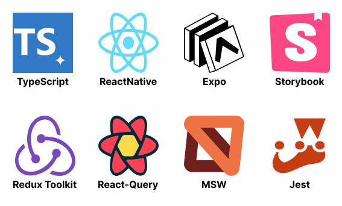

## 🛠️ 프로젝트

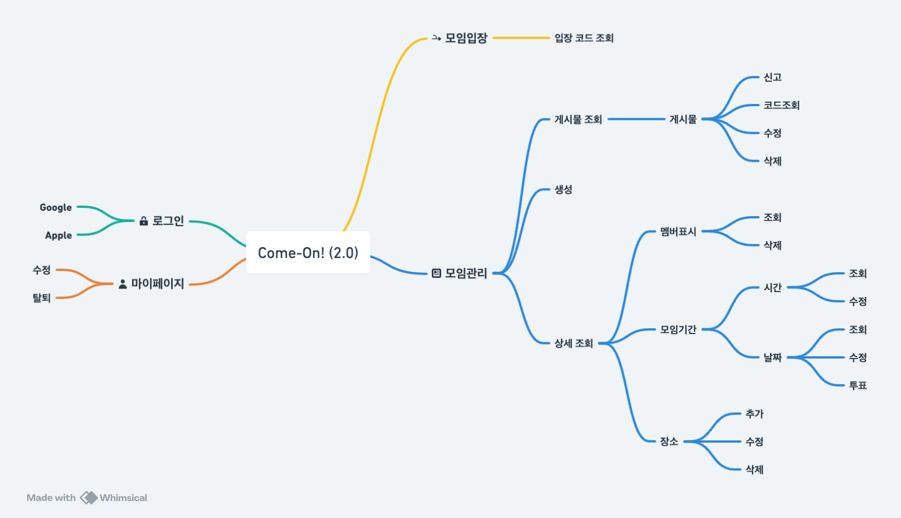

### 모듈 구조

이 프로젝트는 여러 모듈로 구성되어 있으며, 각 모듈은 특정 기능을 담당합니다. 아래는 프로젝트의 주요 모듈과 그 하위 구조에 대한 설명입니다.

[레거시 프로젝트 구조 개선하기: 기능별 모듈화](https://medium.com/@jeongbaebang/%EB%A0%88%EA%B1%B0%EC%8B%9C-%ED%94%84%EB%A1%9C%EC%A0%9D%ED%8A%B8-%EA%B5%AC%EC%A1%B0-%EA%B0%9C%EC%84%A0%ED%95%98%EA%B8%B0-f53b36c7d698)

### account
- **api**: 계정 관련 API 인터페이스
- **components**: 계정 관련 리액트 컴포넌트
- **features**: 리덕스 슬라이스 및 상태 관리 로직
- **hooks**: 커스텀 훅
- **mocks**: 테스트를 위한 모의 데이터
- **navigation**: 네비게이션 설정
- **screens**: 스크린 컴포넌트

### app
- **api**: 애플리케이션 전반에 걸친 API 인터페이스
- **components**: 공통 리액트 컴포넌트
- **hooks**: 애플리케이션 레벨의 커스텀 훅
- **mocks**: 앱 전반에 사용되는 모의 데이터
- **navigation**: 앱의 루트 네비게이션 구조
- **redux**: 앱 상태 관리를 위한 리덕스 스토어 및 프로바이더

### connection
- **api**: 연결 관련 API 인터페이스
- **components**: 연결 및 네트워킹 관련 컴포넌트
- **hooks**: 연결 관련 커스텀 훅
- **mocks**: 연결 기능 테스트를 위한 모의 데이터
- **screen**: 연결 관련 화면 컴포넌트

### post
- **api**: 게시글 관련 API 인터페이스
- **components**: 게시글과 관련된 컴포넌트
- **features**: 게시글 관련 상태 관리 로직
- **hooks**: 게시글 기능을 위한 커스텀 훅
- **mocks**: 게시글 기능 테스트를 위한 모의 데이터
- **navigation**: 게시글 관련 네비게이션 설정
- **screens**: 게시글 관련 스크린 컴포넌트

### shared
- **assets**: 이미지, 아이콘, 폰트 등의 자산
- **components**: 전역에서 사용될 수 있는 공통 컴포넌트
- **constants**: 애플리케이션 전반에 사용되는 상수 정의
- **hooks**: 여러 모듈에서 재사용할 수 있는 커스텀 훅
- **provider**: 공통 컨텍스트 프로바이더

각 모듈은 독립적인 기능을 가지며, 함께 작동하여 애플리케이션을 구성합니다.

### 디자인 시스템

레거시 프로젝트에서 겪었던 UI 컴포넌트 수정의 어려움과 문서화의 부족을 개선하기 위해, 2.0 프로젝트에서는 Storybook과 [컴포넌트 기반 설계(CDD)](https://www.componentdriven.org/)를 도입했습니다. 이를 통해 컴포넌트를 기반으로 화면을 점진적으로 조립하는 새로운 개발 프로세스를 구축, 디자이너와의 소통을 향상시키고 컴포넌트의 수정 및 관리를 용이하게 만들었습니다.

 

### Unit Testing
자주 사용되는 유틸리티 함수들의 리팩토링과 기능 확장 시 코드의 정상 작동을 보장하기 위해 테스트 코드를 작성하였습니다.

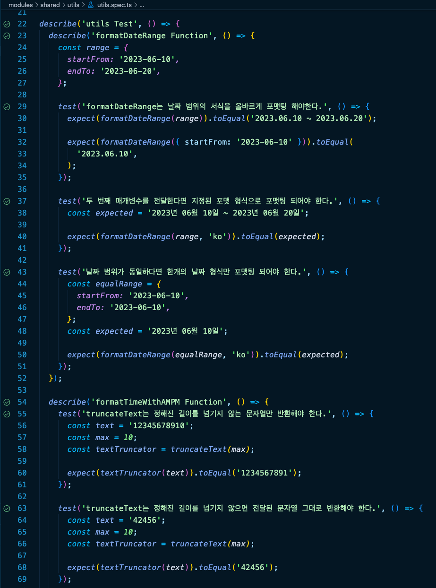

[유틸 함수 테스트 코드 일부분]

 

### 컴포넌트 동작 검증을 위한 RNTL 활용
RNTL(React Native Testing Library)을 활용하여 컴포넌트 내 동작과 Props 전달 시 정상적인 렌더링이 이루어지는지를 중심으로 테스트 코드를 작성하였습니다.

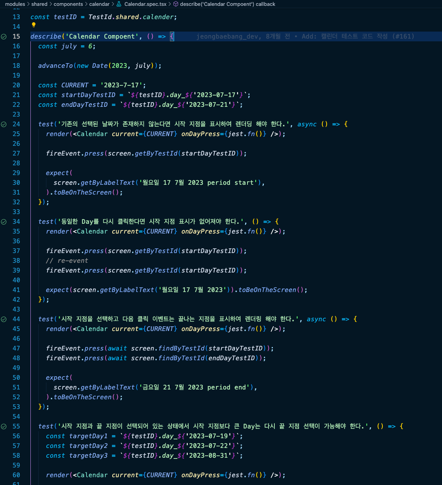

[사용자 동작 테스트 코드]

 

## 🏓 협업

### 백엔드팀과의 API 문서 기반 협업
API 문서를 기반으로 백엔드팀과 협업하여 프로젝트를 수행했습니다

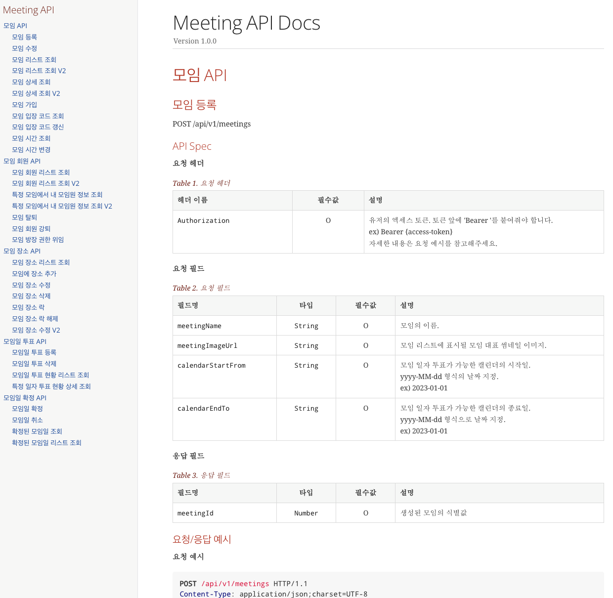

[백엔드 API 문서 일부분]

 

### PR 코드 리뷰
담당한 기능 구현이 완료되거나 수정 사항이 있을 경우, 바로 병합하지 않고 PR(풀 리퀘스트)을 통해 코드 리뷰를 실시한 후 작업 브랜치에 병합하는 방식으로 협업하여 개발했습니다.

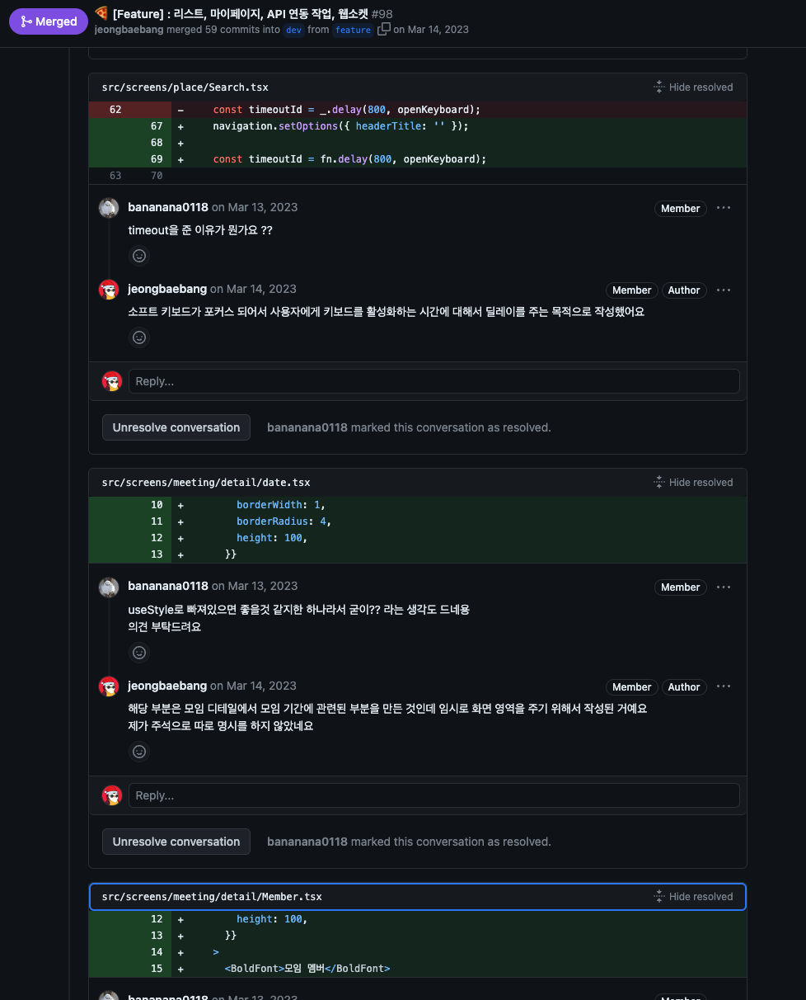

[PR 피드백 세션 스크린샷]

 

### 피그마를 통한 디자이너와의 원활한 커뮤니케이션
디자이너와 디자인 관련 커뮤니케이션은 피그마를 활용하여 진행하며 프로젝트를 수행했습니다.

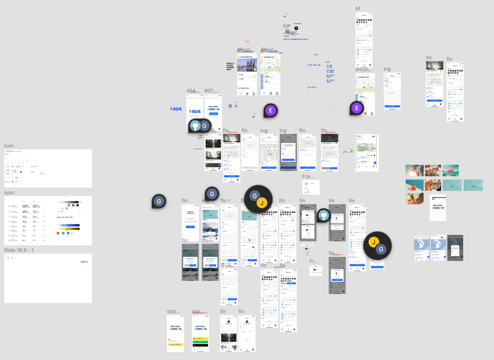

[피그마 UI/UX 작업]

 

### 협업 도구

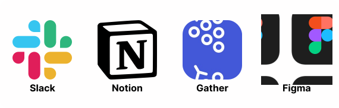

## 🚀 Deploy

### Analytics
Firebase Analytics를 활용해 MAU(월간 활성 사용자 수) 및 DAU(일간 활성 사용자 수) 데이터를 시각화하고, 이를 통해 중요한 인사이트를 도출했습니다.

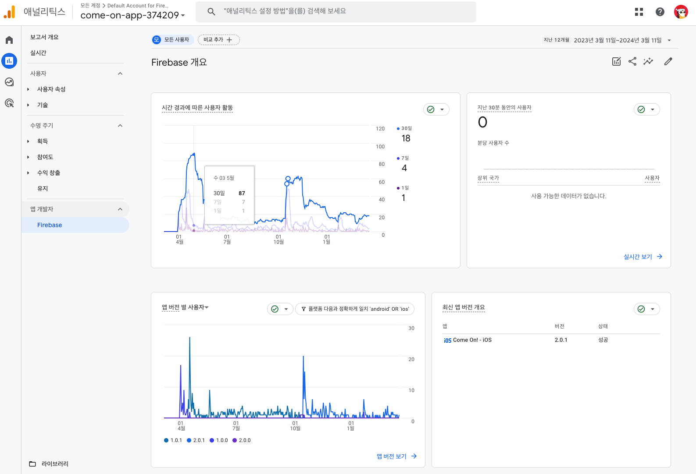

[월간 및 일간 사용자 추적 지표]

 

### Performance
Firebase Performance를 활용해 각 플랫폼별 API 응답 시간을 데이터 통계화함으로써 시스템의 성능 분석과 상태를 명확하게 파악했습니다.

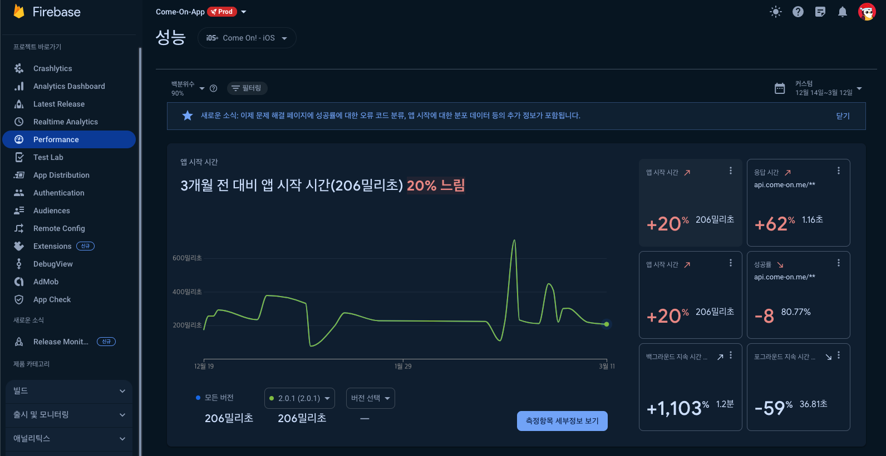

[iOS 플랫폼 성능 평가 항목]

 

## 📝 Article

- [기기별 사이즈에 따른 레이아웃 너비 개선](https://medium.com/@jeongbaebang/%EC%9D%BC%EA%B4%80%EB%90%9C-%EB%94%94%EC%9E%90%EC%9D%B8-%EA%B2%BD%ED%97%98%EC%9D%84-%EC%9C%84%ED%95%9C-%EA%B0%9C%EB%B0%9C%EC%A0%81-%EA%B3%A0%EB%AF%BC-%EB%94%94%EC%9E%90%EC%9D%B8-%EC%8B%9C%EC%8A%A4%ED%85%9C%EA%B3%BC-%EC%BB%B4%ED%8F%AC%EB%84%8C%ED%8A%B8%EC%9D%98-%ED%99%9C%EC%9A%A9-d1a8b0bd126b)

- [MSW를 도입하여 백엔드 API 의존성 제거](https://medium.com/@jeongbaebang/msw-%EB%8F%84%EC%9E%85%EC%9C%BC%EB%A1%9C-%EB%B3%80%ED%99%94%ED%95%9C-%EA%B0%9C%EB%B0%9C-%EA%B2%BD%ED%97%98-%EB%B0%B1%EC%97%94%EB%93%9C-%EC%9D%98%EC%A1%B4%EC%84%B1-%ED%95%B4%EA%B2%B0%EA%B3%BC-%EA%B0%9C%EB%B0%9C-%EC%86%8D%EB%8F%84-%ED%96%A5%EC%83%81-1e495df66020)

- [레거시 프로젝트 구조 개선하기: 기능별 모듈화](https://medium.com/@jeongbaebang/%EB%A0%88%EA%B1%B0%EC%8B%9C-%ED%94%84%EB%A1%9C%EC%A0%9D%ED%8A%B8-%EA%B5%AC%EC%A1%B0-%EA%B0%9C%EC%84%A0%ED%95%98%EA%B8%B0-f53b36c7d698)

- [토큰 기반 로그인 프로세스로 효율적인 로그인 관리 구현](https://jeongbaebang.com/2023/08/19/%ED%9A%A8%EC%9C%A8%EC%A0%81%EC%9D%B8-%EB%A1%9C%EA%B7%B8%EC%9D%B8-%EA%B4%80%EB%A6%AC%EB%A5%BC-%EC%9C%84%ED%95%9C-%EC%95%A1%EC%84%B8%EC%8A%A4-%ED%86%A0%ED%81%B0%EA%B3%BC-%EB%A6%AC%ED%94%84%EB%A0%88/)